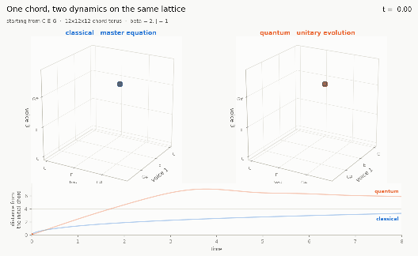

# The Xenakis Master Equation

A Markov generator for Iannis Xenakis's *sound graphs*, written as a stochastic
Hamiltonian in the Baez–Biamonte sense, lifted to a Lindblad equation, and
simulated on the 1728-chord lattice of three voices in twelve-tone space.

**[Live write-up and interactive simulator →](https://dmitry-guskov.github.io/xenakis-master-equation/)**



---

## The model

A chord is a point `n = (n₁,n₂,n₃)` on the lattice `Λ = Z₁₂³` — twelve pitch
classes, one coordinate per voice, 1728 points, a discrete 3-torus. The only
elementary event is one voice sliding a semitone, `n → n ± eᵢ`.

```
∂P(n,t)/∂t = Σᵢ Σₛ [ wᵢˢ(n − s eᵢ) P(n − s eᵢ, t) − wᵢˢ(n) P(n,t) ]

wᵢˢ(n) = γ (1 + s aᵢ) / ( 1 + exp( β [ V(n + s eᵢ) − V(n) ] ) )
```

* `γ` — tempo, events per unit time per voice
* `aᵢ ∈ (−1,1)` — the glissando: a signed drift for voice *i*, Xenakis's velocity
* `β` — inverse temperature: `β = 0` is a Brownian pitch cloud, `β → ∞` freezes
  onto the consonant chords

These are Glauber rates, so they are bounded by `γ(1+|aᵢ|)` and, at `a = 0`,
satisfy detailed balance exactly with respect to `exp(−βV)`. A nonzero drift
multiplies the balance ratio by `(1+a)/(1−a)`; detailed balance breaks and a
steady probability current runs around the pitch circle. **That current is the
glissando.**

### Tension operator

```
V(n) = −λ Σᵢ<ⱼ c(nᵢ−nⱼ)  +  U Σᵢ<ⱼ δ(nᵢ,nⱼ)  −  μ maxᵣ Σ_{p ∈ set(n)} h(p−r)
```

`c(d) = 1/√(pq)` for the simplest 5-limit ratio naming interval class `d`,
symmetrised over inversion; `U` penalises unisons (the Hubbard repulsion of the
quantum model); `h` is the harmonic-series weight over a candidate root
(virtual pitch).

The three-body term is not decoration. With `μ = 0`, pairwise consonance alone
is minimised by a **stack of fifths** — two perfect fifths beat a fifth plus two
thirds — so the triad is *not* a two-body ground state. At `μ = λ` the spectrum
reorders:

| level | V | interval pattern | name | degeneracy |
|---|---:|---|---|---:|
| ground | −3.4651 | (0, 4, 7) | major triad | 72 |
| 1st | −3.3406 | (0, 5, 10) | quartal / quintal stack | 72 |
| 2nd | −3.3334 | (0, 2, 9) | added-sixth fragment | 72 |
| 3rd | −3.2651 | (0, 3, 7) | minor triad | 72 |

72 = 12 transpositions × 6 voice orderings. The minor triad is split from the
major by the three-body term alone — the two have identical pairwise interval
content.

### Continuum limit

Expanding the Glauber rate for slowly varying `V` and keeping the first two
Kramers–Moyal coefficients gives a Smoluchowski equation with mobility `γβ/2`
and diffusion `D = γ/2`, so `D / mobility = 1/β`: the Einstein relation holds
and `β` is a temperature in the honest sense. Setting `V = 0` recovers the
*Pithoprakta* cloud spreading as `√(γt)`.

## Baez–Biamonte form

Species are pairs `(i,p)` — "voice *i* is on pitch *p*", 36 of them. One unary
transition per `(i,p,s)`. With the stochastic conventions `a†|n⟩ = |n+1⟩` and
`a|n⟩ = n|n−1⟩`, the Petri-net Hamiltonian is

```
H = Σ_τ r_τ ( a†^{T(τ)} − a†^{S(τ)} ) a^{S(τ)}
  = Σᵢ Σₚ Σₛ wᵢˢ(p) ( a†_(i,p+s) − a†_(i,p) ) a_(i,p)
```

Probability conservation becomes a one-line identity: `⟨−|a†ₖ = ⟨−|` for every
`k`, so `⟨−|H = 0` term by term. Restricted to the one-token-per-voice sector
this reduces to the generator above.

Because every transition is unary, the companion **rate equation** has the same
shape as the master equation — one voice's distribution and a hundred voices'
density obey the same law. That is the precise sense in which Xenakis's masses
behave like probabilities.

## Quantum generalisation

Read the same species and transitions with bosonic operators and the pitch
circle becomes a Bose–Hubbard model whose long-range coupling *is* the
consonance kernel. In the one-token-per-voice sector,
`Ĥ_Q = −J Σᵢ (Sᵢ + Sᵢ†) + V̂`. Keep the stochasticity by promoting each
classical rate to a Lindblad jump operator:

```
L_τ = Σₙ √(wᵢˢ(n)) |n + s eᵢ⟩⟨n|          L_τ† L_τ = Σₙ wᵢˢ(n) |n⟩⟨n|

dρ/dt = −i[Ĥ_Q, ρ] + Σ_τ ( L_τ ρ L_τ† − ½{L_τ†L_τ, ρ} )
                    + κ Σₙ ( Πₙ ρ Πₙ − ½{Πₙ, ρ} )
```

* At `J = 0` the populations obey the classical master equation **identically**
  (5.6 × 10⁻¹⁷), not approximately.
* For any `J`, `κ → ∞` recovers it, via the Zeno-suppressed effective rate
  `W = 2J²κ / (κ² + ΔV²)`.
* What is new: interference (ballistic vs diffusive transport), entanglement
  between voices, and the measurement interval as a compositional parameter.

## Results

| quantity | value |
|---|---|
| lattice | 12³ = 1728 chords |
| ground manifold | 72 states = the 12 major triads × 6 voicings |
| classical spreading exponent | 0.50 (diffusive) |
| quantum spreading exponent | 0.98 (ballistic) |
| decoherence crossover | 0.3245 → 0.0180 as κ: 0 → 128 |

`verify.py` asserts every structural claim numerically, including that the
Baez–Biamonte Fock-space assembly equals the Markov chain it encodes (exact to
machine zero on an independent bosonic Petri net).

## Layout

```
xen.py           the model: tension operator, generator, Petri assembly,
                 classical / Schrödinger / Lindblad integrators, Gillespie
verify.py        the check suite (numbers quoted above and in the write-up)
figures.py       figures 1–3
anim.py          the 3D animation (mp4 + gif)
sonify.py        both dynamics rendered to audio
page.src.html    source of the write-up; {{FIG*}} tokens for the assets
build_page.py    inlines assets -> self-contained HTML, or --external -> docs/
checkpage.py     headless-Chromium smoke test of the published page
out/             rendered figures, animation, audio, cached sweeps
docs/            the GitHub Pages build
```

## Running it

```bash
pip install -r requirements.txt

python verify.py           # the check suite (slow: the Lindblad sweep is ~40 min)
python figures.py          # figures 1-3 into out/
python anim.py             # 3D animation into out/
python sonify.py           # two WAVs into out/
python build_page.py       # self-contained write-up
python build_page.py --external   # docs/ for GitHub Pages
```

`figures.py` reuses `out/traces.npz` for the dephasing sweep if it exists;
delete it to recompute from scratch.

## Sources

The stochastic-mechanics formalism — stochastic states, the sum covector,
infinitesimal stochastic Hamiltonians, the Petri-net Hamiltonian and its
companion rate equation — follows John Baez and Jacob Biamonte, *Quantum
Techniques for Stochastic Mechanics*. The music is Xenakis's: the ruled
glissando surfaces of *Metastaseis*, the Maxwell–Boltzmann pitch cloud of
*Pithoprakta*, and the screen-to-screen Markov chains of *Analogique A/B*, set
out in *Formalized Music*. The tension operator, the quantum lift and every
number here are constructions of this repository, not of either source.

## Licence

MIT.
